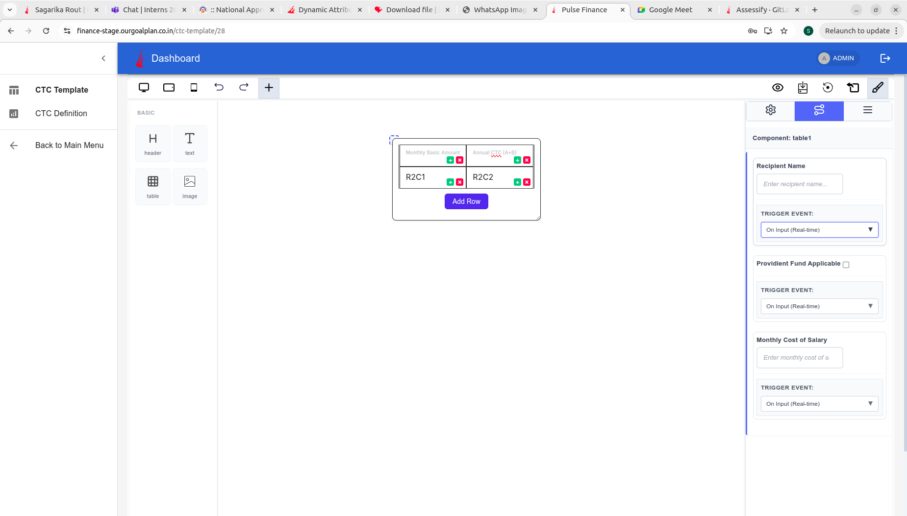

# Dynamic Attributes and Formulas

The Page Builder provides a powerful system for creating **dynamic, data-driven components** through flexible attribute configuration. Attributes enable components to perform **real-time calculations, display static values, accept user input, and render images**—all orchestrated through event-driven formula execution and callback functions.


_Table component with dynamic attributes showing input fields in the Attribute Tab with trigger events_

---

## Attribute System Overview

Attributes define how components behave and interact with data. Each component can have multiple attributes that are configured independently and executed in a specified order.

### Component Attribute Structure

```typescript
export interface ComponentAttribute {
  id: string; // Unique identifier for the attribute
  type: 'Constant' | 'Formula' | 'Input' | 'Image'; // Attribute type
  input_type?: 'text' | 'number' | 'checkbox'; // Input field type (optional for Formula/Image)
  title: string; // Display label for the attribute
  value: string | number | boolean; // Current or initial value
  key: string; // Reference key for calculations
  execute_order: number; // Order of execution in calculations
  editable?: boolean; // Whether the attribute value can be edited
  default_value?: string | number | boolean | null; // Value displayed on refresh or initial load
}
```

**Note on `default_value`:** When a `default_value` is provided, it will be displayed instead of the calculated `value` when the component is first loaded or refreshed. This is particularly useful for Input, Constant, and seeded Formula attributes to display a baseline or placeholder value before calculations occur.

### Component Configuration with Attributes

```typescript
export interface BasicComponent {
  name: string;
  attributes?: ComponentAttribute[];
  globalExecuteFunction?: Function;
}

export interface DynamicComponents {
  Basic: BasicComponent[];
  Extra: string[];
  Custom?: Record<string, CustomComponentConfig>;
}
```

---

## Attribute Types

The Page Builder supports four attribute types, each serving a specific purpose in your component's data flow:

### 1. **Constant Type**

Constant attributes represent **static, predefined values** that remain unchanged during normal operation.

**Characteristics:**

- Displays a fixed value in the component or table cell
- Can be edited in the UI for temporary display changes
- During formula calculations, the **original constant value is used**, not the edited value
- Useful for reference values, tax rates, or fixed multipliers

**Example Usage:**

```typescript
{
  id: 'tax-rate-id',
  type: 'Constant',
  input_type: 'number',
  title: 'Tax Rate',
  value: 18,
  key: 'tax_rate',
  execute_order: 1
}
```

**Behavior:**

- In the Attribute Tab, you can edit the displayed value in the UI
- When formulas are calculated, the original value (18) is used
- The edited value is only reflected in the visual display

### 2. **Input Type**

Input attributes allow **users to enter values dynamically** that affect component behavior and calculations.

**Characteristics:**

- Displays an editable input field based on the `input_type` (text, number, checkbox)
- Can be marked as `editable: true` (default) or `editable: false`
- When `editable: false`, the input field is read-only in the Attribute Tab
- Appears in the Attribute Tab when the component is selected
- Triggers calculation events (onChange, onBlur, etc.)
- User-entered values are passed to the `globalExecuteFunction`

**Example Usage:**

```typescript
const dynamicAttributes: ComponentAttribute[] = [
  {
    id: 'input-a',
    type: 'Input',
    input_type: 'number',
    title: 'Input A',
    value: 10,
    key: 'input-a-key',
    execute_order: 1,
    editable: true,
    default_value: 10,
  },
  {
    id: 'input-b',
    type: 'Input',
    input_type: 'number',
    title: 'Input B',
    value: 5,
    key: 'input-b-key',
    execute_order: 2,
    editable: true,
    default_value: 5,
  },
];
```

**Display and Interaction:**


_Attribute Tab showing various input types with their trigger events_

- The `title` property displays as the label in the Attribute Tab
- The `value` property shows as the default value in the input field
- When `editable: true`, users can modify the value
- When `editable: false`, the field is read-only but still visible
- Each input attribute has an associated trigger event selector

### 3. **Formula Type**

Formula attributes perform **calculations based on other attributes** using formula strings that reference attribute keys.

**Characteristics:**

- Executes mathematical or logical expressions
- References other attributes by their `key` property
- Executed in order specified by `execute_order`
- Result is calculated when the trigger event is fired
- Cannot be directly edited by users; value is always calculated
- The formula string is executed by the `globalExecuteFunction`

**Example Usage:**

```typescript
const dynamicAttributes: ComponentAttribute[] = [
  // Input attributes
  {
    id: 'input-a',
    type: 'Input',
    input_type: 'number',
    title: 'Input A',
    value: 10,
    key: 'input-a-key',
    execute_order: 1,
    editable: true,
    default_value: 10,
  },
  {
    id: 'input-b',
    type: 'Input',
    input_type: 'number',
    title: 'Input B',
    value: 5,
    key: 'input-b-key',
    execute_order: 2,
    editable: true,
    default_value: 5,
  },
  // Formula attributes
  {
    id: 'formula-sum',
    type: 'Formula',
    title: 'Total Sum',
    value: '{Input A} + {Input B}', // Formula string for display
    key: 'formula-sum-key',
    execute_order: 3,
  },
  {
    id: 'formula-product',
    type: 'Formula',
    title: 'Total Product',
    value: '{Input A} * {Input B}',
    key: 'formula-product-key',
    execute_order: 4,
  },
];
```

**Formula Resolution:**

- Formulas reference attributes by their `key` (e.g., `input-a-key`, `input-b-key`)
- The formula string is passed to `globalExecuteFunction` for execution
- Results are calculated in `execute_order` sequence
- Dependent formulas (those referencing other formulas) must have higher `execute_order` values

### 4. **Image Type**

Image attributes enable components to **display images dynamically** from various sources.

**Characteristics:**

- Displays image content in the component
- Value contains the image URL or source path
- Non-editable in the Attribute Tab
- Useful for logos, headers, or dynamic visual content

**Example Usage:**

```typescript
{
  id: 'company-logo-id',
  type: 'Image',
  input_type: 'text',
  title: 'Company Logo',
  value: 'https://example.com/logo.png',
  key: 'company_logo',
  execute_order: 1,
  editable: false
}
```

---

## Data Seeding (Binding Attributes to Components)

Data seeding allows you to **link attribute values directly to component cells or content**. This creates a live connection where changes to attributes are reflected in the rendered output.

### Seeding Workflow


_Modal showing available attributes that can be seeded to a table cell_

**Steps:**

1. **Click on a Table Cell** to select it
2. **Click "Set table-cell-content Attribute" Button** in the Attribute Tab
3. **Component Settings Modal Opens** displaying all available attributes
4. **Select an Attribute** from the list to bind it to the cell
5. **Save** the selection

Once seeded, the selected attribute's value will display in that cell and update whenever the attribute value changes.

### Practical Example: Calculator Table

```typescript
const dynamicAttributes: ComponentAttribute[] = [
  {
    id: 'input-a',
    type: 'Input',
    input_type: 'number',
    title: 'Input A',
    value: 10,
    key: 'input-a-key',
    execute_order: 1,
    editable: true,
    default_value: 10,
  },
  {
    id: 'input-b',
    type: 'Input',
    input_type: 'number',
    title: 'Input B',
    value: 5,
    key: 'input-b-key',
    execute_order: 2,
    editable: true,
    default_value: 5,
  },
  {
    id: 'formula-sum',
    type: 'Formula',
    title: 'Total Sum',
    value: '{Input A} + {Input B}',
    key: 'formula-sum-key',
    execute_order: 3,
  },
  {
    id: 'formula-product',
    type: 'Formula',
    title: 'Total Product',
    value: '{Input A} * {Input B}',
    key: 'formula-product-key',
    execute_order: 4,
  },
];

// In a table, you might seed these attributes to different cells:
// Cell "First Number" → input-a-key
// Cell "Second Number" → input-b-key
// Cell "Sum Result" → formula-sum-key
// Cell "Product Result" → formula-product-key
```

When a user changes "Input A" or "Input B", the Sum and Product formulas recalculate and update in the table.

---

## Event-Driven Calculation System

The Page Builder uses an **event-driven architecture** to trigger attribute calculations. When a user interacts with an Input attribute, the specified trigger event fires, invoking the `globalExecuteFunction` to compute all dependent formulas.

### Trigger Events

For each Input attribute, you can select which event should trigger calculations:

- **On Input (Real-time)**: Fires continuously as the user types (default)
- **On Change**: Fires when the input loses focus or value changes
- **On Blur**: Fires when the input field loses focus
- **On Key Down**: Fires on every key press (advanced use cases)


_Trigger event dropdown showing available event options for input attributes_

### Global Execution Function

The `globalExecuteFunction` is a **callback function provided by the developer** that handles all formula calculations for a component.

**Function Signature:**

```typescript
type GlobalExecuteFunction = (
  inputValues: Record<string, any>
) => Record<string, any>;
```

**Input Parameter:**

- Receives an object containing all attribute values
- Keys are the `key` properties of attributes (not titles)
- Object includes both Input and Constant type attributes
- Example: `{ 'input-a-key': 10, 'input-b-key': 5 }`

**Return Value:**

- Must return an object with calculated results
- Keys should match the `key` properties of Formula attributes
- Values are the calculated results
- Example: `{ 'formula-sum-key': 15, 'formula-product-key': 50 }`

### Implementation Example

#### App.tsx

```typescript
import { PageBuilderReact, ComponentAttribute } from '@mindfiredigital/page-builder-react';
import { localExecuteFunction } from './utils/executeFormula';

const App = () => {
  // Define attributes for a component
  const dynamicAttributes: ComponentAttribute[] = [
    // 1. Input Attribute A (number input)
    {
      id: 'input-a',
      type: 'Input',
      input_type: 'number',
      title: 'Input A',
      value: 10,
      key: 'input-a-key',           // ← Used in globalExecuteFunction input
      execute_order: 1,
      editable: true,
      default_value: 10,
    },

    // 2. Input Attribute B
    {
      id: 'input-b',
      type: 'Input',
      input_type: 'number',
      title: 'Input B',
      value: 5,
      key: 'input-b-key',           // ← Used in globalExecuteFunction input
      execute_order: 2,
      editable: true,
      default_value: 5,
    },

    // 3. Formula Attribute (SUM)
    {
      id: 'formula-sum',
      type: 'Formula',
      title: 'Total Sum',
      value: '{Input A} + {Input B}',  // Formula string for display/debugging
      key: 'formula-sum-key',         // ← Returned from globalExecuteFunction
      execute_order: 3,
    },

    // 4. Formula Attribute (PRODUCT)
    {
      id: 'formula-product',
      type: 'Formula',
      title: 'Total Product',
      value: '{Input A} * {Input B}',
      key: 'formula-product-key',     // ← Returned from globalExecuteFunction
      execute_order: 4,
    },
  ];

  // Configure components with attributes
  const dynamicComponents = {
    Basic: [
      { name: 'button' },
      {
        name: 'header',
        attributes: dynamicAttributes,
        globalExecuteFunction: localExecuteFunction
      },
      {
        name: 'text',
        attributes: dynamicAttributes,
        globalExecuteFunction: localExecuteFunction
      },
      {
        name: 'table',
        attributes: dynamicAttributes,
        globalExecuteFunction: localExecuteFunction
      },
    ],
    Extra: ['landingpage'],
  };

  return (
    <div>
      <PageBuilderReact config={dynamicComponents} />
    </div>
  );
};

export default App;
```

#### utils/executeFormula.ts

```typescript
/**
 * The global execution function that calculates formula attributes.
 * The keys in the inputValues object are the 'key' properties of the Input attributes.
 *
 * @param {object} inputValues - An object where keys are the 'key' (e.g., 'input-a-key') of Input attributes.
 * @returns {object} An object containing the calculated results, where keys are the 'key' of the Formula attributes.
 */
export const localExecuteFunction = (inputValues: {
  'input-a-key': string | number | null;
  'input-b-key': string | number | null;
}) => {
  // Extract and convert input values
  const A = Number(inputValues['input-a-key']) || 0;
  const B = Number(inputValues['input-b-key']) || 0;

  // Perform calculations
  const sumResult = A + B;
  const productResult = A * B;

  // Return object with 'key' properties of Formula attributes
  return {
    'formula-sum-key': sumResult,
    'formula-product-key': productResult,
  };
};
```

**Key Points in this Example:**

- **Input to globalExecuteFunction**: `{ 'input-a-key': 10, 'input-b-key': 5 }`
- **Output from globalExecuteFunction**: `{ 'formula-sum-key': 15, 'formula-product-key': 50 }`
- **Attribute Keys vs Titles**:
  - `title` is displayed to users in the Attribute Tab (e.g., "Input A", "Total Sum")
  - `key` is used internally in the `globalExecuteFunction` (e.g., "input-a-key", "formula-sum-key")
- **Multiple Components**: The same attributes can be reused across multiple components by passing the same `dynamicAttributes` array
- **Trigger Events**: Each Input attribute can have a trigger event selected in the Attribute Tab that determines when `globalExecuteFunction` is called

### Calculation Flow

1. User modifies an Input attribute value
2. Selected trigger event fires (e.g., onChange)
3. `globalExecuteFunction` is called with all Input values
4. Function calculates Formula results using those inputs
5. Calculated values are returned to the Page Builder
6. Component updates to display new calculated values
7. Changes propagate to all seeded table cells

---

## Attribute Execution Order

The `execute_order` property determines the **sequence in which attributes are processed** during calculation. This is critical when formulas depend on other formulas.

**Rules:**

- Lower numbers execute first
- Attributes with the same `execute_order` execute simultaneously
- Formula attributes must have higher `execute_order` than their dependencies
- Input attributes typically have lower `execute_order` than formulas

**Example with Dependencies:**

```typescript
const dynamicAttributes: ComponentAttribute[] = [
  // Order 1-2: Base inputs
  {
    id: 'input-a',
    type: 'Input',
    input_type: 'number',
    title: 'Input A',
    value: 10,
    key: 'input-a-key',
    execute_order: 1,
    editable: true,
    default_value: 10,
  },
  {
    id: 'input-b',
    type: 'Input',
    input_type: 'number',
    title: 'Input B',
    value: 5,
    key: 'input-b-key',
    execute_order: 2,
    editable: true,
    default_value: 5,
  },

  // Order 3: Direct calculations from inputs
  {
    id: 'formula-sum',
    type: 'Formula',
    title: 'Total Sum',
    value: '{Input A} + {Input B}',
    key: 'formula-sum-key',
    execute_order: 3,
  },
  {
    id: 'formula-product',
    type: 'Formula',
    title: 'Total Product',
    value: '{Input A} * {Input B}',
    key: 'formula-product-key',
    execute_order: 4,
  },

  // Order 5: Dependent calculation using previous formulas
  {
    id: 'formula-combined',
    type: 'Formula',
    title: 'Sum of Sum and Product',
    value: '{Total Sum} + {Total Product}',
    key: 'formula-combined-key',
    execute_order: 5,
  },
];
```

---

## Editability Rules

The `editable` property controls whether users can modify an attribute's value in the Attribute Tab. This property has **different implications depending on attribute type**:

### For Input Attributes

- **`editable: true` (default)**: Field is fully editable; users can change the value, and changes trigger calculations
- **`editable: false`**: Field is read-only; users see the value but cannot modify it; still triggers events if other inputs change

**Example:**

```typescript
{
  id: 'calculated-input',
  type: 'Input',
  input_type: 'number',
  title: 'Calculated Value',
  value: 0,
  key: 'calculated-value-key',
  execute_order: 3,
  editable: false  // User cannot edit; calculated by system
}
```

### For Constant Attributes

- The `editable` property is **not applicable** to Constants
- Constants display their value in the component
- During calculations, the **original constant value is always used**, not any edited UI value
- You can change the visual display in the UI for UX purposes, but formulas reference the actual constant

**Example:**

```typescript
{
  id: 'multiplier-const',
  type: 'Constant',
  input_type: 'number',
  title: 'Multiplier',
  value: 2,
  key: 'multiplier',
  execute_order: 1
  // Editability doesn't apply; value is always 2 in calculations
}
```

### For Formula and Image Attributes

- **Always `editable: false`** (implicit)
- Formulas are computed; their values cannot be manually changed
- Images are static; their URLs cannot be edited through attributes
- Both types are read-only in the UI

---

## Complete Integration Example

Here's a comprehensive example showing how all pieces work together:

#### App.tsx

```typescript
import { PageBuilderReact, ComponentAttribute } from '@mindfiredigital/page-builder-react';
import { localExecuteFunction } from './utils/executeFormula';

const App = () => {
  const dynamicAttributes: ComponentAttribute[] = [
    // 1. Input Attribute A (Renders a 'number' input in the Attributes Tab)
    {
      id: 'input-a',
      type: 'Input',
      input_type: 'number',
      title: 'Input A',
      value: 10,
      key: 'input-a-key',
      execute_order: 1,
      editable: true,
      default_value: 10,
    },
    // 2. Input Attribute B
    {
      id: 'input-b',
      type: 'Input',
      input_type: 'number',
      title: 'Input B',
      value: 5,
      key: 'input-b-key',
      execute_order: 2,
      editable: true,
      default_value: 5,
    },
    // 3. Formula Attribute (SUM) - This is calculated by localExecuteFunction
    {
      id: 'formula-sum',
      type: 'Formula',
      title: 'Total Sum',
      value: '{Input A} + {Input B}', // The formula string (used for display/debug)
      key: 'formula-sum-key',
      execute_order: 3,
    },
    // 4. Formula Attribute (PRODUCT)
    {
      id: 'formula-product',
      type: 'Formula',
      title: 'Total Product',
      value: '{Input A} * {Input B}',
      key: 'formula-product-key',
      execute_order: 4,
    },
  ];

  const dynamicComponents = {
    Basic: [
      { name: 'button' },
      {
        name: 'header',
        attributes: dynamicAttributes,
        globalExecuteFunction: localExecuteFunction
      },
      {
        name: 'text',
        attributes: dynamicAttributes,
        globalExecuteFunction: localExecuteFunction
      },
      {
        name: 'table',
        attributes: dynamicAttributes,
        globalExecuteFunction: localExecuteFunction
      },
    ],
    Extra: ['landingpage'],
  };

  return (
    <div>
      <PageBuilderReact config={dynamicComponents} />
    </div>
  );
};

export default App;
```

#### utils/executeFormula.ts

```typescript
/**
 * The global execution function that calculates formula attributes.
 * The keys in the inputValues object are the 'key' properties of the Input attributes.
 *
 * @param {object} inputValues - An object where keys are the 'key' (e.g., 'input-a-key') of Input attributes.
 * @returns {object} An object containing the calculated results, where keys are the 'key' of the Formula attributes.
 */
export const localExecuteFunction = (inputValues: {
  'input-a-key': string | number | null;
  'input-b-key': string | number | null;
}) => {
  const A = Number(inputValues['input-a-key']) || 0;
  const B = Number(inputValues['input-b-key']) || 0;

  const sumResult = A + B;
  const productResult = A * B;

  return {
    'formula-sum-key': sumResult,
    'formula-product-key': productResult,
  };
};
```

**Key Points in this Example:**

- **Input to globalExecuteFunction**: `{ 'input-a-key': 10, 'input-b-key': 5 }`
- **Output from globalExecuteFunction**: `{ 'formula-sum-key': 15, 'formula-product-key': 50 }`
- **In Component Settings Modal**: When you click on a table cell, you see attributes listed by their `title` (e.g., "Input A", "Total Sum")
- **In Attribute Tab**: Input attributes display by their `title` with input fields based on `input_type`, and each has a trigger event selector
- **In Table Cells**: When you seed an attribute to a cell, it displays the calculated value from `globalExecuteFunction` using that attribute's `key`
- **Reusability**: The same `dynamicAttributes` and `localExecuteFunction` are applied to multiple components (header, text, table)
- **Code Organization**: Calculation logic is separated into its own utility file for better maintainability

---

## Best Practices

### Organizing Attributes

1. **Group by dependency**: Place independent attributes first, then dependent formulas
2. **Use consistent naming**: Make `title` and `key` descriptive and related
3. **Set appropriate execute_order**: Always ensure formulas execute after their dependencies
4. **Document complex formulas**: Use clear formula strings that are easy to understand

### Working with User Input

1. **Validate input ranges**: In your `globalExecuteFunction`, validate that inputs are within acceptable ranges
2. **Handle edge cases**: Account for zero values, negative numbers, and null inputs
3. **Provide clear labels**: Use descriptive `title` values so users understand what each attribute does
4. **Set sensible defaults**: Use reasonable `value` defaults for better UX

### Performance Optimization

1. **Minimize calculations**: Only calculate what's necessary; avoid redundant formulas
2. **Use appropriate trigger events**: Avoid "On Input (Real-time)" for expensive calculations; use "On Blur" instead
3. **Lazy execution**: Only execute formulas when relevant attributes change
4. **Memoize results**: In your `globalExecuteFunction`, cache intermediate results if used multiple times

### Error Handling

```typescript
export const robustCalculation = (inputValues: Record<string, any>) => {
  try {
    const A = Number(inputValues['input-a-key']) || 0;
    const B = Number(inputValues['input-b-key']) || 0;

    if (A < 0 || B < 0) {
      throw new Error('Inputs cannot be negative');
    }

    const sumResult = A + B;
    const productResult = A * B;

    return {
      'formula-sum-key': sumResult,
      'formula-product-key': productResult,
    };
  } catch (error) {
    console.error('Calculation error:', error);
    return {
      'formula-sum-key': 0,
      'formula-product-key': 0,
    };
  }
};
```

---

## Summary

The Dynamic Attributes system provides a flexible, powerful way to create data-driven components:

- **Attribute Types**: Choose from Constant, Input, Formula, or Image types based on your needs
- **Data Seeding**: Bind attributes to component cells to display live, calculated data
- **Event-Driven Calculations**: Trigger complex computations when users interact with inputs
- **Controlled Editability**: Fine-grained control over what users can modify
- **Execution Order**: Ensure formulas calculate in the correct sequence
- **Custom Functions**: Implement your own calculation logic through `globalExecuteFunction`

This system enables you to build sophisticated, interactive components that respond to user input in real-time while maintaining data consistency and calculation accuracy.
