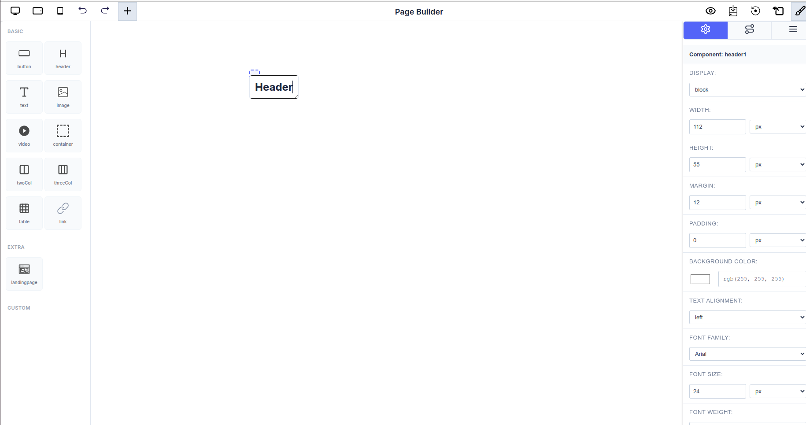
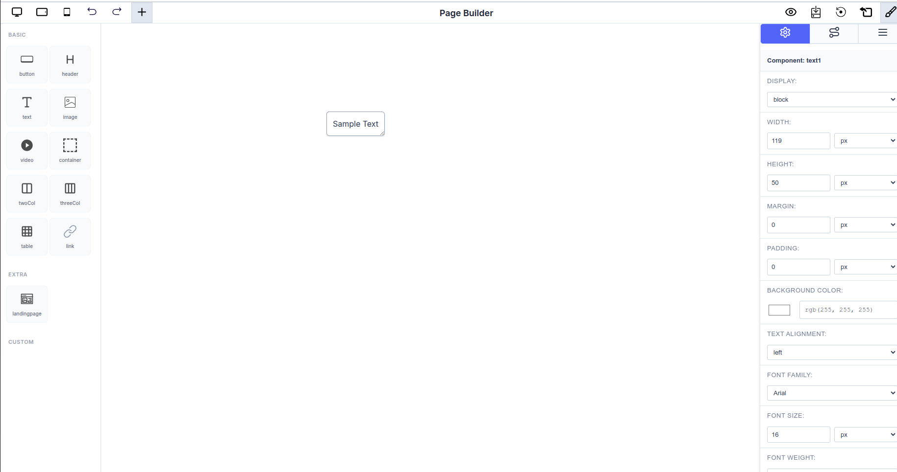
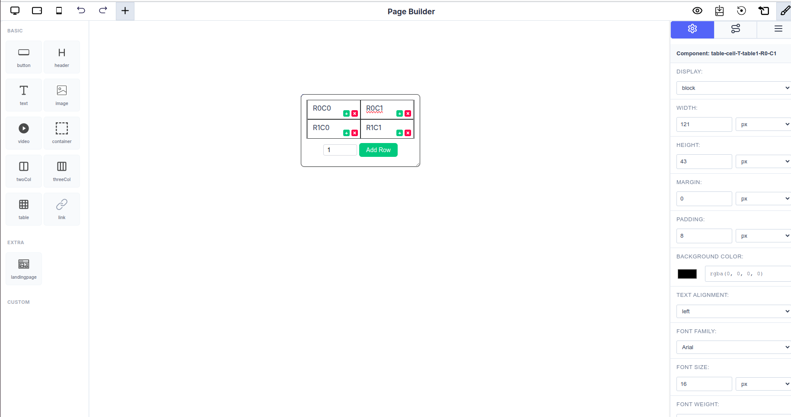

# Page Builder Components

The Page Builder provides a collection of pre-built components that can be enhanced with dynamic attributes. This guide explores how each component works and how attribute seeding enables data-driven behavior.

---

## Header Component

The **Header component** creates prominent titles and headings that can display dynamic content.


_Header component in the Page Builder with styling options_

### Overview

Headers are perfect for:

- Page titles with dynamic dates
- Section headings with calculated totals
- Dynamic report headers
- Status banners with real-time data

### Structure

```typescript
// Header component with dynamic attributes
{
  name: 'header',
  attributes: dynamicAttributes,
  globalExecuteFunction: calculationFunction
}
```

### Editing Header Text

To edit the header text content:

1. **Double-click the Header**: Click twice on the header element in the canvas
2. **Edit Inline**: The text becomes editable directly in place
3. **Type Your Content**: Enter your desired header text
4. **Click Outside**: Click anywhere outside the header to save changes

The header text can be plain static text or combined with seeded attribute values for dynamic content.

### Styling Options

The right panel shows various styling options for headers:

- **DISPLAY**: Control how the header is displayed (block, inline, etc.)
- **WIDTH & HEIGHT**: Set dimensions in pixels
- **MARGIN & PADDING**: Control spacing around and inside the header
- **BACKGROUND COLOR**: Choose the header's background color
- **TEXT ALIGNMENT**: Align text left, center, or right
- **FONT FAMILY**: Select from available fonts (Arial, etc.)
- **FONT SIZE**: Set text size in pixels
- **FONT WEIGHT**: Control text boldness

### How Attribute Seeding Works in Headers

Headers can display dynamic attribute values as part of the heading text, making them ideal for creating context-aware titles.

#### Seeding Process

1. **Select the Header Component**: Click on the header element
2. **Access Attribute Tab**: Open the attribute configuration panel
3. **Choose an Attribute**: Select which attribute to display in the header
4. **Dynamic Header**: The header now shows the attribute's value

#### Example: Dynamic Report Header

```typescript
const headerAttributes: ComponentAttribute[] = [
  {
    id: 'report-month',
    type: 'Input',
    input_type: 'text',
    title: 'Report Month',
    value: 'October 2025',
    key: 'report_month',
    execute_order: 1,
    editable: true,
  },
  {
    id: 'total-revenue',
    type: 'Formula',
    input_type: 'number',
    title: 'Total Revenue',
    value: '(product_sales + service_revenue)',
    key: 'total_revenue',
    execute_order: 2,
  },
  {
    id: 'company-name',
    type: 'Constant',
    input_type: 'text',
    title: 'Company Name',
    value: 'ABC Corporation',
    key: 'company_name',
    execute_order: 1,
  },
];

// Configure header component
const dynamicComponents = {
  Basic: [
    {
      name: 'header',
      attributes: headerAttributes,
      globalExecuteFunction: revenueCalculation,
    },
  ],
  Extra: ['landingpage'],
};
```

**Usage Examples:**

```
[Seed: company_name] - Monthly Report
Revenue Report for [Seed: report_month]
Total Revenue: $[Seed: total_revenue]
```

When seeded, displays:

```
ABC Corporation - Monthly Report
Revenue Report for October 2025
Total Revenue: $125,000
```

### Best Practices for Headers

- **Use for key information**: Display important, high-level data
- **Keep titles clear**: Make headers easily scannable
- **Combine constants with dynamics**: Mix static company info with dynamic dates
- **Use appropriate hierarchy**: Choose H1, H2, H3 levels appropriately
- **Edit text directly**: Double-click to quickly update static text

---

## Text Component

The **Text component** displays dynamic text content that can include both static text and dynamic attribute values.


_Text component showing "Sample Text" with styling options_

### Overview

Text components are ideal for:

- Displaying calculated results in sentences
- Dynamic labels and descriptions
- Summary statements
- Real-time status indicators
- Paragraphs and body content

### Structure

```typescript
// Text component with dynamic attributes
{
  name: 'text',
  attributes: dynamicAttributes,
  globalExecuteFunction: calculationFunction
}
```

### Editing Text Content

To edit the text content:

1. **Double-click the Text Element**: Click twice on the text in the canvas
2. **Edit Inline**: The text becomes editable directly
3. **Type Your Content**: Enter or modify the text content
4. **Click Outside**: Click anywhere outside to save your changes

You can write multiple lines, paragraphs, or combine static text with attribute values.

### Styling Options

The right panel provides comprehensive text styling:

- **DISPLAY**: Control display type (block, inline, etc.)
- **WIDTH & HEIGHT**: Set component dimensions
- **MARGIN & PADDING**: Adjust spacing
- **BACKGROUND COLOR**: Set background color
- **TEXT ALIGNMENT**: Left, center, right, or justify alignment
- **FONT FAMILY**: Choose font (Arial, Times New Roman, etc.)
- **FONT SIZE**: Adjust text size (default: 16px)
- **FONT WEIGHT**: Normal, bold, or custom weights

### How Attribute Seeding Works in Text

Text components can display attribute values inline within text content. Unlike tables, text components typically show a single attribute value or a combination of text and values.

#### Seeding Process

1. **Select the Text Component**: Click on the text element
2. **Open Attribute Settings**: Access the Attribute Tab
3. **Bind an Attribute**: Choose which attribute value to display
4. **Content Updates**: The text displays the attribute's current value

#### Example: Dynamic Salary Display

```typescript
const displayAttributes: ComponentAttribute[] = [
  {
    id: 'employee-name',
    type: 'Input',
    input_type: 'text',
    title: 'Employee Name',
    value: 'John Doe',
    key: 'employee_name',
    execute_order: 1,
    editable: true,
  },
  {
    id: 'net-salary',
    type: 'Formula',
    input_type: 'number',
    title: 'Net Salary',
    value: '(gross_salary - deductions)',
    key: 'net_salary',
    execute_order: 2,
  },
];

// Configure text component
const dynamicComponents = {
  Basic: [
    {
      name: 'text',
      attributes: displayAttributes,
      globalExecuteFunction: salaryCalculation,
    },
  ],
  Extra: ['landingpage'],
};
```

**Usage Examples:**

```
Employee: [Seed: employee_name]
Net Monthly Salary: $[Seed: net_salary]
```

When seeded, displays:

```
Employee: John Doe
Net Monthly Salary: $43296
```

### Best Practices for Text

- **Combine static and dynamic content**: Mix regular text with seeded attributes
- **Use meaningful labels**: Provide context for dynamic values
- **Format appropriately**: Ensure numeric values are properly formatted
- **Keep it concise**: Text components work best with short, focused content
- **Double-click to edit**: Quick way to update static content

---

## Table Component

The **Table component** is one of the most powerful components in the Page Builder, designed for displaying structured, tabular data with dynamic attribute binding.


_Table component showing a 2x2 grid with row and column management buttons_

### Overview

Tables consist of rows and columns where each cell can be seeded with attributes to display dynamic, calculated values. This makes tables ideal for:

- Financial reports and salary structures
- Data summaries and dashboards
- Invoice templates
- Comparison charts
- Structured data presentations

### Structure

```typescript
// Table component with dynamic attributes
{
  name: 'table',
  attributes: dynamicAttributes,
  globalExecuteFunction: calculationFunction
}
```

### Adding and Managing Rows

The table component provides powerful row management functionality:

#### Adding Rows

1. **Using the Add Row Button**:

   - Enter the number of rows in the input field (shown as "1" in the image)
   - Click the green "Add Row" button
   - New rows are added to the bottom of the table

2. **Using Row Action Buttons**:
   - Each row has green **+** (add) and red **-** (delete) buttons on the right
   - Click the **+** button to add a new row directly below the current row
   - Click the **-** button to delete that specific row

#### Adding Columns

Each cell has column management buttons:

1. **Add Column**: Click the green **+** button at the top-right of any cell
2. **Remove Column**: Click the red **-** button at the top-right of any cell
3. **Columns are added/removed for the entire table**, maintaining table structure

### Editing Cell Content

To edit text in a table cell:

1. **Double-click the Cell**: Click twice on any cell content
2. **Edit Inline**: The cell text becomes editable
3. **Type Your Content**: Enter your text or labels
4. **Click Outside**: Click outside the cell to save

You can enter static labels (like "Basic Salary", "HRA", "Total") or seed dynamic attribute values.

### Styling Options

The right panel shows table cell styling options:

- **DISPLAY**: Control cell display properties
- **WIDTH & HEIGHT**: Set cell dimensions
- **MARGIN & PADDING**: Control cell spacing (padding: 8px shown)
- **BACKGROUND COLOR**: Set cell background (black shown in image)
- **TEXT ALIGNMENT**: Align cell content
- **FONT FAMILY**: Choose cell font
- **FONT SIZE**: Set text size (16px default)
- **FONT WEIGHT**: Control text weight

### How Attribute Seeding Works in Tables

Attribute seeding in tables creates a **live connection** between table cells and attribute values. When an attribute value changes, all seeded cells automatically update.

#### Step-by-Step Seeding Process

1. **Select a Table Cell**: Click on any cell in your table to select it
2. **Open Attribute Settings**: Click the "Set table-cell-content Attribute" button in the Attribute Tab
3. **Choose an Attribute**: A modal appears showing all available attributes by their `title`
4. **Bind the Attribute**: Select an attribute to bind it to the cell
5. **Save**: The cell now displays the attribute's value


_Modal showing available attributes for seeding_

#### Example: Salary Structure Table

```typescript
const salaryAttributes: ComponentAttribute[] = [
  {
    id: 'basic-input',
    type: 'Input',
    input_type: 'number',
    title: 'Basic Salary',
    value: 50000,
    key: 'basic_salary',
    execute_order: 1,
    editable: true,
  },
  {
    id: 'hra-formula',
    type: 'Formula',
    input_type: 'number',
    title: 'HRA Amount',
    value: '(basic_salary * 0.15)',
    key: 'hra_amount',
    execute_order: 2,
  },
  {
    id: 'total-formula',
    type: 'Formula',
    input_type: 'number',
    title: 'Total Salary',
    value: '(basic_salary + hra_amount)',
    key: 'total_salary',
    execute_order: 3,
  },
];

// Configure table component
const dynamicComponents = {
  Basic: [
    {
      name: 'table',
      attributes: salaryAttributes,
      globalExecuteFunction: salaryCalculation,
    },
  ],
  Extra: ['landingpage'],
};
```

**Table Layout Example:**

| Component    | Amount                 |
| ------------ | ---------------------- |
| Basic Salary | → Seed: `basic_salary` |
| HRA (15%)    | → Seed: `hra_amount`   |
| Total Salary | → Seed: `total_salary` |

**Creating this table:**

1. Start with a 3x2 table (3 rows, 2 columns)
2. Double-click first column cells and enter labels: "Basic Salary", "HRA (15%)", "Total Salary"
3. Select the second column cells one by one
4. Seed each cell with the corresponding attribute
5. When users change the Basic Salary input, all cells update automatically

#### Real-Time Updates

When a user modifies the "Basic Salary" input:

1. The `globalExecuteFunction` recalculates HRA and Total
2. All seeded cells update automatically
3. The table reflects the new values instantly

### Table Management Tips

- **Start with structure**: Plan your rows and columns before seeding
- **Use the input field**: Add multiple rows at once using the "Add Row" input
- **Row-by-row addition**: Use the green + button for precise row placement
- **Column management**: Add/remove columns as needed for each cell
- **Edit labels first**: Double-click cells to add static labels before seeding
- **Seed values after**: Once labels are in place, seed the data cells

### Best Practices for Tables

- **Organize by calculation order**: Place input values in top rows, calculated values below
- **Use clear labels**: Make column headers and row labels descriptive
- **Seed formulas appropriately**: Bind the correct attribute to each cell
- **Format numbers**: Use `input_type: 'number'` for numeric attributes
- **Test interactivity**: Verify that changing inputs updates all seeded cells
- **Manage rows efficiently**: Use the bulk add feature for multiple rows

---

## Common Attribute Seeding Patterns

### Pattern 1: Input-to-Display

Seed an Input attribute directly to display user-entered values:

```typescript
// In Attribute Tab: User enters "50000"
// In Table Cell: Displays "50000"
```

### Pattern 2: Formula-to-Display

Seed a Formula attribute to show calculated results:

```typescript
// Formula calculates: basic_salary * 0.15
// In Table Cell: Displays "7500"
```

### Pattern 3: Multiple Components, Same Attributes

Reuse the same attributes across multiple components:

```typescript
const sharedAttributes = [...];

const dynamicComponents = {
  Basic: [
    { name: 'header', attributes: sharedAttributes, globalExecuteFunction: calc },
    { name: 'text', attributes: sharedAttributes, globalExecuteFunction: calc },
    { name: 'table', attributes: sharedAttributes, globalExecuteFunction: calc }
  ]
};
```

All three components share the same attribute values and update together.

### Pattern 4: Cascading Updates

Seed attributes in order of calculation dependency:

```typescript
// Table Structure:
// Row 1: Basic Salary [input] - Double-click to edit label, seed attribute
// Row 2: HRA [formula using basic_salary] - Seed formula attribute
// Row 3: Total [formula using basic_salary + hra] - Seed total formula

// When Row 1 changes:
// - Row 2 recalculates automatically
// - Row 3 recalculates using new Row 2 value
// - All updates happen in execute_order sequence
```

---

## Component Configuration Example

Here's a complete example configuring all three components with shared attributes:

```typescript
import { PageBuilderReact, ComponentAttribute } from '@mindfiredigital/page-builder-react';
import { globalCalculation } from './utils/calculations';

const App = () => {
  // Shared attributes for all components
  const sharedAttributes: ComponentAttribute[] = [
    {
      id: 'input-value',
      type: 'Input',
      input_type: 'number',
      title: 'Input Value',
      value: 100,
      key: 'input_value',
      execute_order: 1,
      editable: true,
      default_value: 100
    },
    {
      id: 'multiplier',
      type: 'Constant',
      input_type: 'number',
      title: 'Multiplier',
      value: 2.5,
      key: 'multiplier',
      execute_order: 1
    },
    {
      id: 'result',
      type: 'Formula',
      input_type: 'number',
      title: 'Result',
      value: '(input_value * multiplier)',
      key: 'result',
      execute_order: 2
    }
  ];

  const dynamicComponents = {
    Basic: [
      { name: 'button' },
      {
        name: 'header',
        attributes: sharedAttributes,
        globalExecuteFunction: globalCalculation
      },
      {
        name: 'text',
        attributes: sharedAttributes,
        globalExecuteFunction: globalCalculation
      },
      {
        name: 'table',
        attributes: sharedAttributes,
        globalExecuteFunction: globalCalculation
      }
    ],
    Extra: ['landingpage']
  };

  return (
    <div>
      <PageBuilderReact
        config={dynamicComponents}
        showAttributeTab={true}
      />
    </div>
  );
};

export default App;
```

---

## Summary

The Page Builder's component system enables powerful data-driven interfaces through attribute seeding:

- **Header Component**: Create dynamic titles with inline text editing (double-click)
- **Text Component**: Display dynamic values within text content with inline editing (double-click)
- **Table Component**: Display structured data with:
  - Cell-level attribute binding
  - Dynamic row addition (bulk or individual)
  - Column management per cell
  - Inline cell editing (double-click)

### Key Editing Features

- **Double-click to edit**: All components support inline text editing
- **Row management**: Tables support bulk row addition and row-by-row controls
- **Column controls**: Add/remove columns using cell-level buttons
- **Style customization**: Comprehensive styling options in the right panel

All components share the same attribute system, making it easy to create consistent, synchronized interfaces where changes propagate automatically across all seeded elements.
