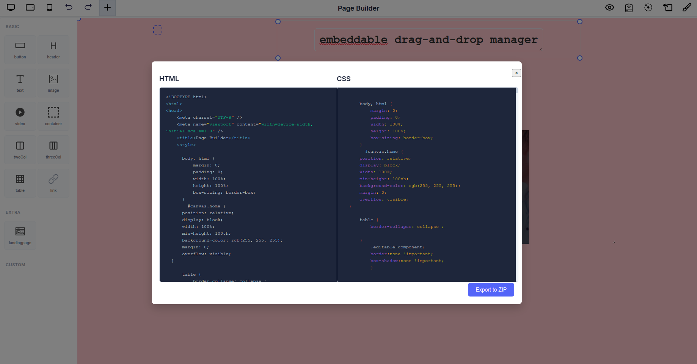

# Design Export Options

## Overview

This page builder provides comprehensive export capabilities, allowing you to transform visual designs into production-ready code and static documents. The system supports multiple export formats to accommodate different workflow requirements.

## Accessing Export Options

Located at the **top right corner** of the page builder interface, you'll find the **Export icon** (📤). Click this icon to reveal two export options:

- **HTML** - Export your design as code
- **PDF** - Save your design as a document

---

## Export Formats

### HTML & CSS Export



Export your complete page design as clean, production-ready HTML and CSS code that can be integrated into any web project.

**How to Export HTML/CSS:**

1. Click the **Export icon** (📤) in the top right corner of the toolbar
2. Select **HTML** from the dropdown menu
3. A modal window displays two tabs: **HTML** and **CSS**
4. Review the generated code in each tab:
   - **HTML Tab**: Complete markup structure including DOCTYPE, meta tags, and all page elements
   - **CSS Tab**: All styling rules, including responsive layouts and custom styles
5. Choose your preferred export method:
   - Click **Copy Code** to copy the code to your clipboard
   - Click **Export to ZIP** to download both HTML and CSS files packaged together

**What's Included:**

- Fully structured HTML5 document with proper semantic markup
- Complete CSS styling with all custom properties
- Viewport meta tags for responsive design
- All layout configurations and positioning rules
- Custom component styles and interactions

**Use Cases:**

- Deploy to production websites
- Integration with existing web applications
- Create static landing pages
- Template development
- Code review and optimization

---

### PDF Export


Generate high-fidelity PDF documents of your page designs for sharing, archiving, or print purposes.

**How to Export PDF:**

1. Click the **Export icon** (📤) in the top right corner of the toolbar
2. Select **PDF** from the dropdown menu
3. Your browser's print dialog will open automatically
4. Configure your PDF settings:
   - **Destination**: Select "Save as PDF"
   - **Pages**: Choose "All" or specify page range
   - **Layout**: Portrait or Landscape orientation
   - **Paper size**: A4, Letter, or custom sizes
   - **Pages per sheet**: Typically set to 1
   - **Margins**: None, Default, Minimum, or Custom
   - **Scale**: Default, Fit to page, or custom percentage
5. Enable **Background graphics** to preserve design colors and images
6. Click **Save** to generate and download the PDF

**What's Included:**

- Pixel-perfect rendering of your page design
- All visual elements including images, colors, and typography
- Background graphics and decorative elements
- Exact layout as displayed in the builder

**Use Cases:**

- Client presentations and design reviews
- Print-ready mockups
- Design documentation and archives
- Sharing with non-technical stakeholders
- Portfolio pieces

---

## Export Capabilities Comparison

| Feature                  | HTML/CSS Export           | PDF Export             |
| ------------------------ | ------------------------- | ---------------------- |
| **Editability**          | Fully editable code       | Static document        |
| **File Size**            | Lightweight               | Larger file size       |
| **Best For**             | Development & deployment  | Sharing & presentation |
| **Preserves**            | Structure and styling     | Visual appearance      |
| **Requires**             | Web browser or editor     | PDF reader             |
| **Interactive Elements** | Functional                | Static snapshot        |
| **Export Options**       | Copy code or ZIP download | Browser save dialog    |

---

## Best Practices

### For HTML/CSS Export:

- Review the generated code for optimization opportunities
- Use **Copy Code** for quick integration into existing projects
- Use **Export to ZIP** for complete file packages
- Test responsive behavior across different screen sizes
- Validate HTML and CSS for web standards compliance
- Consider minification for production deployments
- Check cross-browser compatibility

### For PDF Export:

- Always enable "Background graphics" option
- Choose appropriate paper size for your use case
- Use landscape orientation for wide designs
- Set margins to "None" for full-bleed designs
- Preview before finalizing the export

---

## Technical Implementation

The page builder's export system:

- Generates clean, semantic HTML markup
- Produces organized CSS with proper specificity
- Maintains design integrity across export formats
- Supports custom components and layouts
- Preserves all styling and positioning rules
- Provides flexible code access via copy or download

---

## Quick Reference

### Export Icon Location

```
┌─────────────────────────────────────────┐
│  Page Builder         [Tools]  [📤 Export] │ ← Top Right Corner
├─────────────────────────────────────────┤
│                                         │
│         Your Design Here                │
│                                         │
└─────────────────────────────────────────┘
```

### Export Workflow

```
Click Export Icon (📤)
        │
        ├─→ Select "HTML"
        │   └─→ Modal Opens
        │       ├─→ View HTML/CSS Code
        │       ├─→ Copy Code (to clipboard)
        │       └─→ Export to ZIP (download)
        │
        └─→ Select "PDF"
            └─→ Browser Print Dialog
                └─→ Save as PDF
```

---

## Integration Notes

Exported HTML/CSS can be:

- Integrated into React, Vue, or Angular projects
- Used with static site generators
- Deployed to any web hosting platform
- Customized further in your preferred code editor
- Version controlled using Git

The embeddable drag-and-drop manager ensures all exported code maintains the same visual layout and functionality as designed in the builder interface.

---
