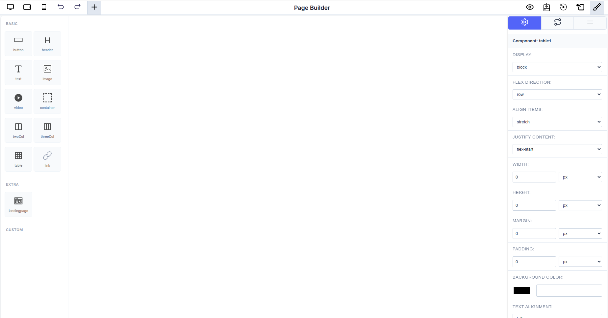

# Drag-and-Drop Editor

The heart of the Page Builder is its intuitive **Drag-and-Drop Editor**, providing a real-time, WYSIWYG (What You See Is What You Get) environment. This feature simplifies the process of page creation, making it accessible to both developers and non-technical users.


_The complete Page Builder interface showing the component library (left), canvas (center), and component settings panel (right)_

---

## Interface Overview

The Page Builder consists of three main areas:

1. **Component Sidebar (Left)**: Contains draggable components organized into Basic, Extra, and Custom categories
2. **Canvas (Center)**: The main workspace where you build your page visually
3. **Settings Panel (Right)**: Detailed property controls for the selected component

---

## Configuring Available Components

You can customize which components appear in the sidebar by passing a configuration object to the Page Builder. This allows you to control exactly which components are available to your users.

### React Package Usage

```typescript
import { PageBuilderReact } from '@mindfiredigital/page-builder-react';

const App = () => {
  const dynamicComponents = {
    Basic: [
      { name: 'button' },
      { name: 'header' },
      { name: 'text' },
      { name: 'table' },
    ],
    Extra: ['landingpage'],
  };

  return (
    <div>
      <PageBuilderReact
        config={dynamicComponents}
      />
    </div>
  );
};

export default App;
```

## Seamless Component Management

The editor allows for effortless construction and manipulation of your page structure directly on the canvas.

### Adding Components

- Components from the **Sidebar Library** (both built-in and custom components) can be dragged onto any available area of the canvas.
- Available components include:
  - **BASIC**: Button, Header, Text, Table
  - **EXTRA**: Landing Page
  - **CUSTOM**: Color Picker Component, Custom Rating Component, Image
- **Indicators** will guide you, showing where the component can be successfully dropped into the layout hierarchy.

### Arranging and Structuring

- Once placed, components can be **selected and rearranged** within their containers by simply clicking and dragging them to a new position.
- This allows for **quick iteration** and structural changes without touching the underlying code.

### Real-Time Editing

- All changes—whether moving a component or modifying its properties in the **Settings Panel**—are reflected instantly on the canvas.
- The Settings Panel offers complete control over component properties including:
  - Display mode, dimensions (width/height)
  - Spacing (margin/padding)
  - Background color and text alignment
  - Typography (font family, size, weight)
- Provides immediate **visual feedback** for all modifications.

---

## Additional Features

- **Responsive Preview**: Toggle between desktop, tablet, and mobile views using the icons in the top toolbar
- **History Controls**: Undo and redo buttons for easy navigation through changes
- **Quick Actions**: Access additional tools and settings via the top-right toolbar
