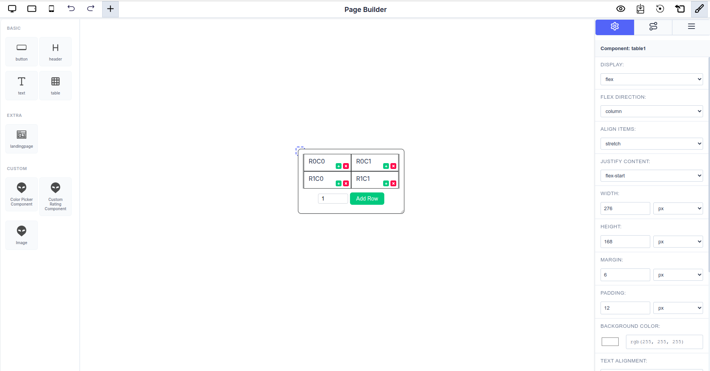
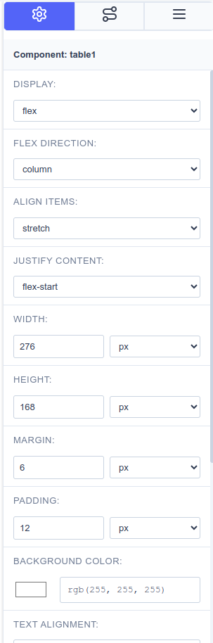
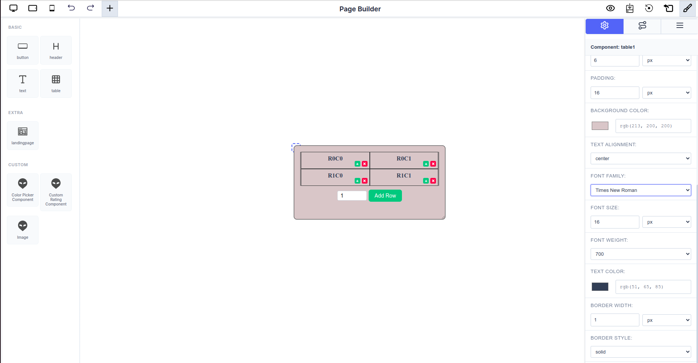

# Customization and Styling

The visual editor works in conjunction with the Sidebar's **Settings Panel** to provide granular control over every element. This intuitive workflow allows you to select, inspect, and customize any component on your page with precision.

_The Page Builder interface showing a selected text component with its properties displayed in the Settings Panel_

---

## Component Selection and Editing Workflow

### 1. Selection

- Click any component on the canvas to **select** it.
- The selected component will be highlighted with a visual indicator (typically a border or outline).
- You can select nested components by clicking directly on them within their parent containers.

### 2. Settings Panel Activation

- Upon selection, the Sidebar automatically switches to the **Settings Panel**.
- The panel displays all configurable properties for that specific component.
- Properties are organized into logical sections for easy navigation.

_The Settings Panel showing comprehensive configuration options for a text component_

### 3. Customization Options

Users can seamlessly customize the component's appearance, behavior, and content through the Settings Panel:

#### **Display Properties**

- Control how the component renders (block, inline-block, flex, etc.)
- Set component visibility and display modes

#### **Dimensions**

- **Width**: Set precise widths using multiple units (px, %, em, rem, vw, vh)
- **Height**: Define height with the same flexible unit options
- Supports responsive sizing for different screen sizes

#### **Spacing**

- **Margin**: Control outer spacing around the component
- **Padding**: Adjust inner spacing within the component
- Apply uniform spacing or customize individual sides

#### **Styling**

- **Background Color**: Choose colors using the integrated color picker
- **Text Alignment**: Align content left, center, right, or justify
- **Borders**: Configure border styles, widths, and colors
- **Shadows**: Add depth with box and text shadows

#### **Typography**

- **Font Family**: Select from available font families (Arial, Helvetica, Times New Roman, etc.)
- **Font Size**: Adjust text size with pixel precision
- **Font Weight**: Control text boldness (normal, bold, lighter, bolder, or numeric values)
- **Line Height**: Set spacing between lines of text
- **Letter Spacing**: Fine-tune character spacing

#### **Advanced Properties**

- **Attributes**: Configure dynamic attributes and formulas for interactive components
- **Data Binding**: Connect components to data sources
- **Event Handlers**: Set up component behaviors and interactions
- **Content**: Edit text, images, and other direct content inline

---

## Real-Time Visual Feedback

_Changes made in the Settings Panel are instantly reflected on the canvas_

Every modification made in the Settings Panel is immediately reflected on the canvas:

- **Instant Updates**: No need to save or preview—see changes as you make them
- **WYSIWYG Experience**: What you see in the editor is exactly what you get in the final output
- **Iterative Design**: Quickly experiment with different styles and configurations
- **Undo/Redo Support**: Easily revert changes if needed using the history controls

---

## Example: Customizing a Text Component

Here's a typical workflow for customizing a text component:

1. **Select** the text component on the canvas
2. **Settings Panel** opens automatically showing:
   - Display: `block`
   - Width: `119px`
   - Height: `50px`
   - Margin: `6px`
   - Padding: `0px`
   - Background Color: RGB selector
   - Text Alignment: `left`
   - Font Family: `Arial`
   - Font Size: `16px`
3. **Adjust properties** as needed—each change appears instantly on the canvas
4. **Fine-tune** until you achieve the desired look

---

## Best Practices for Customization

### Consistent Styling

- Use consistent spacing (margins and padding) across similar components
- Maintain a cohesive color palette throughout your design
- Stick to a limited set of font families for better readability

### Responsive Design

- Test different width units (%, vw) for responsive layouts
- Use relative units (em, rem) for typography to scale better
- Check your design in different viewport sizes using the preview toggles

### Performance Considerations

- Avoid excessive nesting of components when possible
- Use appropriate display properties for optimal rendering
- Keep custom styling organized and minimal

### Accessibility

- Ensure sufficient color contrast between text and backgrounds
- Use semantic font sizes and weights
- Maintain readable line heights and letter spacing

---
