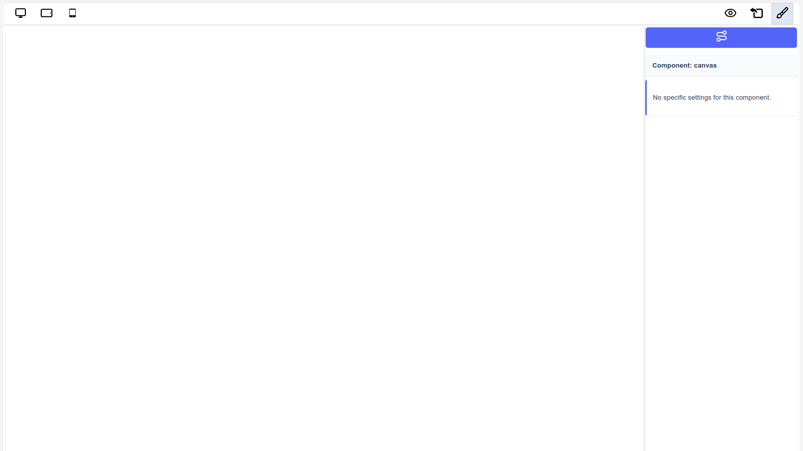
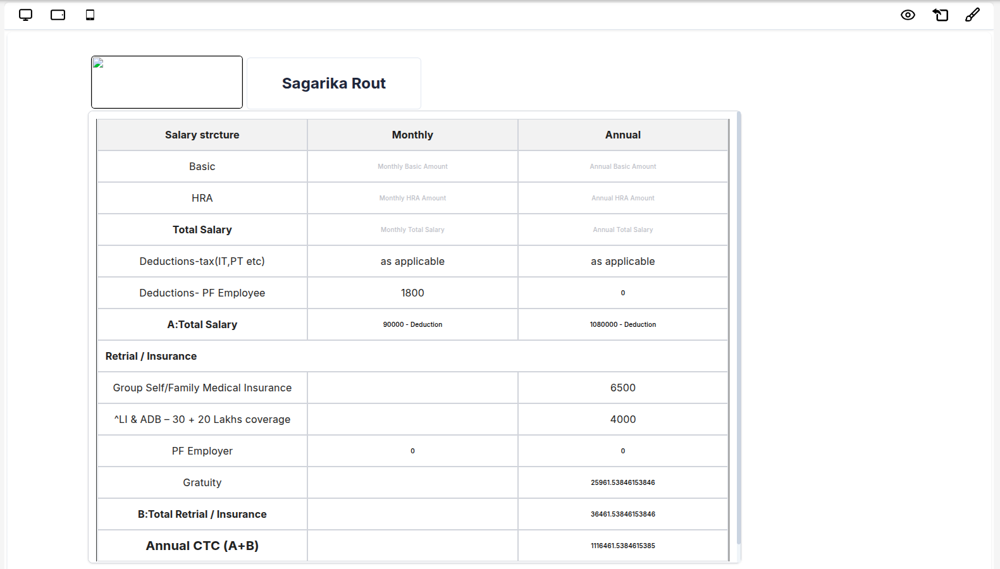

# View Mode (Read-Only)

The **Page Builder** supports a dedicated **View Mode**, which permanently disables all editing capabilities for published designs. This mode is distinct from the **Preview Mode** button, which temporarily shows how a design looks during the creation process.

---

## Overview

**View Mode vs Preview Mode:**

| Feature    | Preview Mode                             | View Mode                                  |
| ---------- | ---------------------------------------- | ------------------------------------------ |
| Purpose    | Temporary preview during design creation | Permanent read-only state after publishing |
| Access     | Available via Preview button in editor   | Enabled programmatically via props         |
| Use Case   | Designer checks their work in progress   | Published design locked for end users      |
| Reversible | Yes - return to edit mode anytime        | Controlled by application logic            |

### When to Use View Mode

View Mode is designed for **post-publication scenarios** where you want to:

- **Lock published designs** to prevent unauthorized modifications
- **Deploy completed pages** to production environments
- **Share finalized content** with users who should only consume, not edit
- **Archive approved designs** while maintaining visibility
- **Create read-only instances** of templates or published content

---

## Disabled Features in View Mode

When **View Mode** is active, the following actions are disabled:

- **Drag & Drop**: Users cannot move, add, or rearrange components
- **Component Selection**: Components cannot be selected on the canvas
- **Styling/Settings**: The Sidebar/Settings Panel is hidden or inactive
- **Resizing/Interaction**: Component resizing handles, editing borders, and other interactive editing controls are suppressed

The design is rendered as a clean, final output ready for **presentation or embedding**.

---

## Enabling View Mode

You can enable View Mode by passing the `editable` prop to the `PageBuilderReact` component.

### Basic Usage

```jsx
import { PageBuilderReact } from '@mindfiredigital/page-builder-react';

const App = () => {
  return (
    <div>
      <PageBuilderReact editable={false} />
    </div>
  );
};

export default App;
```

---

## Attribute Tab in View Mode

While View Mode disables editing capabilities, you can still provide access to the **Attribute Tab** for viewing component properties and details. This is useful when you want users to inspect component configurations without the ability to modify them.

### Enabling Attribute Tab

Set the `showAttributeTab` prop to `true` along with `editable={false}`:

```jsx
import { PageBuilderReact } from '@mindfiredigital/page-builder-react';

const App = () => {
  const dynamicComponents = {
    Basic: [
      { name: 'button' },
      { name: 'header' },
      { name: 'text' },
      { name: 'table' },
    ],
    Extra: ['landingpage'],
  };

  return (
    <div>
      <PageBuilderReact
        showAttributeTab={true}
        editable={false}
        config={dynamicComponents}
      />
    </div>
  );
};

export default App;
```

### Attribute Tab Behavior in View Mode

When `showAttributeTab={true}` is set in View Mode:

- ✅ Users can **view** component attributes and properties
- ✅ The attribute panel displays component configurations
- ✅ Component details remain accessible for inspection
- ❌ Users **cannot modify** any attributes or settings
- ❌ All input fields and controls remain disabled

---

## Props Reference

| Prop               | Type      | Default | Description                                                              |
| ------------------ | --------- | ------- | ------------------------------------------------------------------------ |
| `editable`         | `boolean` | `true`  | Controls whether the page builder is in edit mode or view mode           |
| `showAttributeTab` | `boolean` | `false` | Shows the attribute tab in view mode for inspecting component properties |
| `config`           | `object`  | -       | Configuration object for available components                            |

---

## Visual Examples

### View Mode With Attribute Tab

When both `editable={false}` and `showAttributeTab={true}` are set, users can access a read-only attribute panel to inspect component properties while the canvas remains non-editable.

**Example: Salary Structure View**


_Figure 1: View Mode displaying a salary structure table with attribute tab enabled. Users can view component details but cannot edit them._

The above example shows a professional salary breakdown for "Sagarika Rout" displayed in View Mode. Notice how:

- The canvas displays the final rendered design cleanly
- The attribute tab is accessible on the right side
- All editing controls (drag handles, resize controls, etc.) are hidden
- The design maintains its formatting and structure

### View Mode Without Attribute Tab

When `editable={false}` and `showAttributeTab` is not set or `false`, the page displays in pure presentation mode with no sidebar or controls.

**Example: Clean Canvas View**


_Figure 2: Pure view mode with no attribute tab - minimal, distraction-free display._

In this example:

- The canvas area is completely clean and uncluttered
- No sidebars or panels are visible
- The focus is entirely on the rendered content
- Perfect for embedding or full-screen presentations

---

## Typical Workflow

1. **Design Phase**: User creates and edits the design with `editable={true}` (default)
2. **Preview Phase**: User uses the built-in Preview button to check the design
3. **Publish Phase**: User completes the design and publishes it
4. **View Mode**: Application switches to `editable={false}` to lock the published design
5. **Consumption**: End users view the locked, non-editable version

---

## Use Cases

### 1. Publishing System

```jsx
const PublishedPage = ({ pageId, isPublished }) => {
  return <PageBuilderReact editable={!isPublished} pageId={pageId} />;
};
```

**Scenario**: A content creator designs a landing page. Once satisfied, they click "Publish". The system sets `editable={false}`, locking the design for all subsequent viewers.

### 2. Role-Based Access Control

```jsx
const RoleBasedPageBuilder = ({ userRole }) => {
  const canEdit = userRole === 'admin' || userRole === 'editor';

  return (
    <PageBuilderReact
      editable={canEdit}
      showAttributeTab={userRole === 'viewer' || userRole === 'reviewer'}
    />
  );
};
```

**Scenario**: Admins and editors can modify designs, while viewers and reviewers can only inspect (with attribute tab) or view the content.

### 3. Template Distribution

```jsx
const TemplateViewer = ({ templateId }) => {
  return (
    <PageBuilderReact
      editable={false}
      showAttributeTab={true}
      templateId={templateId}
    />
  );
};
```

**Scenario**: Distribute approved templates to users who need to see the structure and configuration but cannot modify the master template.

### 4. Approval Workflow

```jsx
const ApprovalWorkflow = ({ designStatus }) => {
  const isApproved = designStatus === 'approved';

  return <PageBuilderReact editable={!isApproved} showAttributeTab={true} />;
};
```

**Scenario**: Designs go through an approval process. Once approved, they're locked (`editable={false}`) to prevent further changes while reviewers can still inspect attributes.

### 5. Version History

```jsx
const VersionHistory = ({ version, isCurrentVersion }) => {
  return (
    <PageBuilderReact
      editable={isCurrentVersion}
      version={version}
      showAttributeTab={true}
    />
  );
};
```

**Scenario**: Users can view historical versions of a design in read-only mode, with only the current version being editable.

### 6. Multi-Environment Deployment

```jsx
const EnvironmentBasedBuilder = () => {
  const isDevelopment = process.env.NODE_ENV === 'development';

  return (
    <PageBuilderReact
      editable={isDevelopment}
      showAttributeTab={isDevelopment}
    />
  );
};
```

**Scenario**: Development environment allows editing, while staging and production environments display locked versions.

---

## Best Practices

1. **Distinguish from Preview**: Remember that Preview Mode (button in editor) is for checking work during design, while View Mode is for locking published content
2. **Implement publish workflows**: Use View Mode as part of a publishing system where designs transition from editable to locked
3. **Consider role-based access**: Tie `editable` prop to user permissions and roles
4. **Enable Attribute Tab selectively**: Use `showAttributeTab={true}` when users need to inspect configurations without editing
5. **Version control**: Keep editable versions separate from published, locked versions
6. **Audit trail**: Log when designs transition from editable to view mode (published state)
7. **Conditional rendering**: Dynamically control `editable` based on application state, user role, or environment

---

## Common Patterns

### Pattern 1: Simple Publish Toggle

```jsx
const [isPublished, setIsPublished] = useState(false);

const handlePublish = () => {
  // Save design to database
  saveDesign();
  // Lock the design
  setIsPublished(true);
};

return (
  <>
    {!isPublished && <button onClick={handlePublish}>Publish Design</button>}
    <PageBuilderReact editable={!isPublished} />
  </>
);
```

### Pattern 2: Permission-Based Access

```jsx
const { user } = useAuth();
const canEdit = user.permissions.includes('edit_designs');

return <PageBuilderReact editable={canEdit} showAttributeTab={!canEdit} />;
```

### Pattern 3: Status-Driven Mode

```jsx
const { design } = useDesign(designId);
const isEditable = design.status === 'draft';

return (
  <PageBuilderReact
    editable={isEditable}
    showAttributeTab={design.status === 'published'}
  />
);
```

---

## Notes

- **View Mode is not the same as Preview Mode**: Preview Mode is a temporary view during design creation (accessed via button), while View Mode is a permanent locked state for published designs
- View Mode does not affect the underlying data structure; it only controls whether editing is allowed
- The `editable` prop can be toggled dynamically based on your application's business logic
- All component functionality remains active in View Mode; only editing controls are disabled
- Consider implementing a "Publish" workflow that transitions designs from editable to view mode
- View Mode is ideal for production environments where end users should consume content, not modify it
