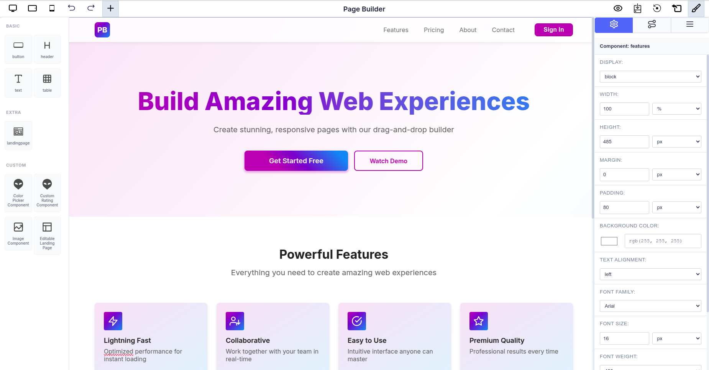

# React Package Examples

Complete examples demonstrating how to use the Page Builder React package with custom components, dynamic attributes, and state management.

---

## Basic Setup

### Installation

```bash
npm install @mindfiredigital/page-builder-react
```

### Simple Configuration

The most basic setup with built-in components:

```typescript
import { PageBuilderReact } from '@mindfiredigital/page-builder-react';

const App = () => {
  const dynamicComponents = {
    Basic: [
      { name: 'button' },
      { name: 'header' },
      { name: 'text' },
      { name: 'table' },
    ],
    Extra: ['landingpage'],
  };

  return (
    <div>
      <PageBuilderReact config={dynamicComponents} />
    </div>
  );
};

export default App;
```

---

## Dynamic Attributes Example

### Using Input and Formula Attributes

This example demonstrates how to use dynamic attributes with calculations:

#### Step 1: Define the Global Execution Function

```typescript
// utils/executeFormula.ts
/**
 * The global execution function that calculates formula attributes.
 * Keys in inputValues match the 'key' properties of Input and Constant attributes.
 *
 * @param {object} inputValues - Object with keys like 'input-a-key', 'input-b-key'
 * @returns {object} Object with keys matching Formula attribute keys
 */
export const localExecuteFunction = (inputValues: Record<string, any>) => {
  const A = Number(inputValues['input-a-key']) || 0;
  const B = Number(inputValues['input-b-key']) || 0;

  const sumResult = A + B;
  const productResult = A * B;

  console.log(
    `Calculation: A=${A}, B=${B}, Sum=${sumResult}, Product=${productResult}`
  );

  return {
    'formula-sum-key': sumResult,
    'formula-product-key': productResult,
  };
};
```

#### Step 2: Define Component Attributes

```typescript
// App.tsx
import { PageBuilderReact, ComponentAttribute } from '@mindfiredigital/page-builder-react';
import { localExecuteFunction } from './utils/executeFormula';

const App = () => {
  const dynamicAttributes: ComponentAttribute[] = [
    // Input attributes
    {
      id: 'input-a',
      type: 'Input',
      input_type: 'number',
      title: 'Input A',
      value: 10,
      default_value: 10,
      key: 'input-a-key',
      execute_order: 1,
      editable: true,
    },
    {
      id: 'input-b',
      type: 'Input',
      input_type: 'number',
      title: 'Input B',
      value: 5,
      default_value: 5,
      key: 'input-b-key',
      execute_order: 2,
      editable: true,
    },

    // Formula attributes
    {
      id: 'formula-sum',
      type: 'Formula',
      input_type: 'number',
      title: 'Total Sum',
      value: '{Input A} + {Input B}',
      default_value: 0,
      key: 'formula-sum-key',
      execute_order: 3,
    },
    {
      id: 'formula-product',
      type: 'Formula',
      input_type: 'number',
      title: 'Total Product',
      value: '{Input A} * {Input B}',
      default_value: 1,
      key: 'formula-product-key',
      execute_order: 4,
    },
  ];

  const dynamicComponents = {
    Basic: [
      { name: 'button' },
      {
        name: 'header',
        attributes: dynamicAttributes,
        globalExecuteFunction: localExecuteFunction
      },
      {
        name: 'text',
        attributes: dynamicAttributes,
        globalExecuteFunction: localExecuteFunction
      },
      {
        name: 'table',
        attributes: dynamicAttributes,
        globalExecuteFunction: localExecuteFunction
      },
    ],
    Extra: ['landingpage'],
  };

  return (
    <div>
      <PageBuilderReact config={dynamicComponents} />
    </div>
  );
};

export default App;
```

---

## Custom Components Example

### Creating a Custom Color Picker Component

#### Step 1: Build the Color Picker Component

```typescript
// components/ColorPicker.tsx
import React, { forwardRef } from 'react';

interface ColorPickerProps {
  componentId?: string;
  color?: string;
}

const ColorPicker = forwardRef<HTMLDivElement, ColorPickerProps>(
  (props, forwardedRef) => {
    const { componentId, color = '#FF5733' } = props;

    return (
      <div
        ref={forwardedRef}
        style={{
          display: 'flex',
          flexDirection: 'column',
          alignItems: 'center',
          justifyContent: 'center',
          width: '200px',
          height: '150px',
          border: '2px solid #ccc',
          borderRadius: '8px',
          backgroundColor: '#f9f9f9',
          padding: '16px',
        }}
      >
        <label htmlFor="color-input" style={{ marginBottom: '12px', fontWeight: 600 }}>
          Select Color:
        </label>
        <input
          id="color-input"
          type="color"
          defaultValue={color}
          style={{
            width: '100px',
            height: '50px',
            border: 'none',
            borderRadius: '4px',
            cursor: 'pointer',
          }}
        />
        <p style={{ marginTop: '12px', fontSize: '0.875rem', color: '#666' }}>
          Current: {color}
        </p>
      </div>
    );
  }
);

ColorPicker.displayName = 'ColorPicker';
export default ColorPicker;
```

#### Step 2: Create Settings Panel for Color Picker

```typescript
// settings/ColorPickerSettings.tsx
import React, { forwardRef } from 'react';
import { Box, Button, Typography } from '@mui/material';

interface ColorPickerSettingsProps {
  targetComponentId: string;
}

const ColorPickerSettings = forwardRef<unknown, ColorPickerSettingsProps>(
  (props, forwardedRef) => {
    const { targetComponentId } = props;

    const handleRandomColor = () => {
      const randomColor = '#' + Math.floor(Math.random() * 16777215).toString(16);
      console.log(`Random color for ${targetComponentId}: ${randomColor}`);
    };

    return (
      <Box
        ref={forwardedRef}
        sx={{
          p: 2,
          border: '1px solid #e0e0e0',
          borderRadius: '4px',
          mt: 2,
          display: 'flex',
          flexDirection: 'column',
          gap: 1,
        }}
      >
        <Typography variant="h6" sx={{ mb: 1, fontSize: '1rem' }}>
          Color Picker Settings
        </Typography>
        <Button
          variant="outlined"
          color="primary"
          onClick={handleRandomColor}
          sx={{ textTransform: 'none' }}
        >
          Generate Random Color
        </Button>
      </Box>
    );
  }
);

export default ColorPickerSettings;
```

### Creating a Custom Rating Component

#### Step 1: Set Up State Management with Zustand

```typescript
// store/RatingStore.ts
import { create } from 'zustand';

interface RatingState {
  ratings: Record<string, number | null>;
  resetRating: (componentId: string) => void;
  setRatingToMax: (componentId: string) => void;
  incrementRating: (componentId: string) => void;
  decrementRating: (componentId: string) => void;
  setValue: (componentId: string, value: number | null) => void;
  getRating: (componentId: string) => number | null;
}

export const useRatingStore = create<RatingState>((set, get) => ({
  ratings: {},

  resetRating: (componentId: string) => {
    set(state => ({
      ratings: { ...state.ratings, [componentId]: 0 },
    }));
  },

  setRatingToMax: (componentId: string) => {
    set(state => ({
      ratings: { ...state.ratings, [componentId]: 5 },
    }));
  },

  incrementRating: (componentId: string) => {
    const current = get().ratings[componentId] ?? 2;
    const newValue = Math.min(current + 1, 5);
    set(state => ({
      ratings: { ...state.ratings, [componentId]: newValue },
    }));
  },

  decrementRating: (componentId: string) => {
    const current = get().ratings[componentId] ?? 2;
    const newValue = Math.max(current - 1, 0);
    set(state => ({
      ratings: { ...state.ratings, [componentId]: newValue },
    }));
  },

  setValue: (componentId: string, value: number | null) => {
    set(state => ({
      ratings: { ...state.ratings, [componentId]: value },
    }));
  },

  getRating: (componentId: string) => {
    return get().ratings[componentId] ?? 2;
  },
}));
```

#### Step 2: Build the Rating Component

```typescript
// components/CustomRating.tsx
import React, { forwardRef } from 'react';
import { Box, Rating, Typography } from '@mui/material';
import { useRatingStore } from '../store/RatingStore';

interface CustomRatingProps {
  componentId?: string;
}

const CustomRating = forwardRef<HTMLDivElement, CustomRatingProps>(
  (props, forwardedRef) => {
    const { componentId } = props;
    const currentComponentId = componentId || 'default';

    const value = useRatingStore(state => state.getRating(currentComponentId));
    const setValue = useRatingStore(state => state.setValue);
    const maxValue = 5;

    const handleChange = (
      event: React.SyntheticEvent<Element, Event>,
      newValue: number | null
    ) => {
      setValue(currentComponentId, newValue);
    };

    return (
      <Box
        ref={forwardedRef}
        sx={{
          display: 'flex',
          flexDirection: 'column',
          alignItems: 'center',
          justifyContent: 'center',
          width: '200px',
          height: '100px',
          border: '2px dashed #94a3b8',
          borderRadius: '8px',
          backgroundColor: '#f1f5f9',
          fontFamily: 'sans-serif',
          fontSize: '14px',
          color: '#64748b',
          margin: '10px',
          padding: '5px',
        }}
      >
        <Typography component="legend">Controlled Rating</Typography>
        <Rating
          name="simple-controlled"
          value={value}
          max={maxValue}
          onChange={handleChange}
        />
        <Typography variant="body2">
          Current Value: {value !== null ? value : 'N/A'}
        </Typography>
      </Box>
    );
  }
);

CustomRating.displayName = 'CustomRating';
export default CustomRating;
```

#### Step 3: Create Rating Settings Panel

```typescript
// settings/CustomRatingSettings.tsx
import React, { forwardRef } from 'react';
import { Box, Button, Typography } from '@mui/material';
import { useRatingStore } from '../store/RatingStore';

interface CustomRatingSettingsProps {
  targetComponentId: string;
}

const CustomRatingSettings = forwardRef<unknown, CustomRatingSettingsProps>(
  (props, forwardedRef) => {
    const { targetComponentId } = props;

    const resetRating = useRatingStore(state => state.resetRating);
    const setRatingToMax = useRatingStore(state => state.setRatingToMax);
    const incrementRating = useRatingStore(state => state.incrementRating);
    const decrementRating = useRatingStore(state => state.decrementRating);

    return (
      <Box
        ref={forwardedRef}
        sx={{
          p: 2,
          border: '1px solid #e0e0e0',
          borderRadius: '4px',
          mt: 2,
          display: 'flex',
          flexDirection: 'column',
          gap: 1,
        }}
      >
        <Typography variant="h6" component="h3" sx={{ mb: 1, fontSize: '1rem' }}>
          Rating Controls
        </Typography>
        <Button
          variant="outlined"
          color="primary"
          onClick={() => resetRating(targetComponentId)}
          sx={{ textTransform: 'none', borderRadius: '8px' }}
        >
          Reset Rating
        </Button>
        <Button
          variant="outlined"
          color="primary"
          onClick={() => setRatingToMax(targetComponentId)}
          sx={{ textTransform: 'none', borderRadius: '8px' }}
        >
          Set Max Rating
        </Button>
        <Button
          variant="outlined"
          color="primary"
          onClick={() => incrementRating(targetComponentId)}
          sx={{ textTransform: 'none', borderRadius: '8px' }}
        >
          Increment Rating
        </Button>
        <Button
          variant="outlined"
          color="primary"
          onClick={() => decrementRating(targetComponentId)}
          sx={{ textTransform: 'none', borderRadius: '8px' }}
        >
          Decrement Rating
        </Button>
      </Box>
    );
  }
);

export default CustomRatingSettings;
```

### Creating a Custom Landing Page Component

The Landing Page component demonstrates how to build a fully-featured, responsive component with embedded styles and complex layouts:

```typescript
// components/LandingPage.tsx
import React, { useState, forwardRef, Ref, useEffect } from 'react';

interface LandingPageProps {
  componentId?: string;
}

const LandingPage = forwardRef<HTMLDivElement, LandingPageProps>(
  (props, forwardedRef) => {
    const [isMobile, setIsMobile] = useState<boolean>(false);
    const [isMobileMenuOpen, setIsMobileMenuOpen] = useState<boolean>(false);

    useEffect(() => {
      const checkMobile = () => {
        setIsMobile(window.innerWidth < 960);
      };
      checkMobile();
      window.addEventListener('resize', checkMobile);
      return () => window.removeEventListener('resize', checkMobile);
    }, []);

    const toggleDrawer = (open: boolean) => (
      event: React.KeyboardEvent | React.MouseEvent
    ): void => {
      if (
        event.type === 'keydown' &&
        ((event as React.KeyboardEvent).key === 'Tab' ||
          (event as React.KeyboardEvent).key === 'Shift')
      ) {
        return;
      }
      setIsMobileMenuOpen(open);
    };

    const navItems = [
      { name: 'Features', href: '#features' },
      { name: 'Pricing', href: '#pricing' },
      { name: 'About', href: '#about' },
      { name: 'Contact', href: '#contact' },
    ];

    return (
      <div ref={forwardedRef} className="lp-body">
        <style>
          {`
            @import url('https://fonts.googleapis.com/css2?family=Inter:wght@400;600;700;800&display=swap');
            * { box-sizing: border-box; margin: 0; padding: 0; }
            html { scroll-behavior: smooth; }
            .lp-body {
              font-family: 'Inter', sans-serif;
              min-height: 100vh;
              background: linear-gradient(to bottom right, #F3E5F5, #FFFFFF 50%, #E3F2FD);
              color: #212121;
            }
            .lp-container {
              max-width: 1280px;
              margin: 0 auto;
              padding: 0 16px;
            }
            .lp-navbar {
              position: sticky;
              top: 0;
              z-index: 1000;
              background-color: rgba(255, 255, 255, 0.8);
              backdrop-filter: blur(10px);
              box-shadow: 0 0 10px rgba(0,0,0,0.1);
            }
            .lp-navbar-content {
              display: flex;
              justify-content: space-between;
              align-items: center;
              height: 64px;
            }
            .lp-logo {
              width: 40px;
              height: 40px;
              background: linear-gradient(to bottom right, #9C27B0, #2196F3);
              border-radius: 8px;
              display: flex;
              align-items: center;
              justify-content: center;
              color: white;
              font-weight: bold;
              font-size: 1.25rem;
            }
            .lp-nav { display: flex; align-items: center; gap: 16px; }
            .lp-nav a { text-decoration: none; color: #757575; }
            .lp-button {
              border: none;
              cursor: pointer;
              padding: 12px 32px;
              border-radius: 8px;
              font-weight: 600;
              transition: all 0.3s;
            }
            .lp-gradient-button {
              background: linear-gradient(45deg, #9C27B0 30%, #2196F3 90%);
              color: white;
            }
            .lp-gradient-button:hover {
              transform: scale(1.05);
              box-shadow: 0 6px 10px rgba(156, 39, 176, 0.5);
            }
            .lp-outlined-button {
              background: transparent;
              color: #9C27B0;
              border: 2px solid #9C27B0;
            }
            .lp-hero {
              padding: 120px 0;
              text-align: center;
              position: relative;
              overflow: hidden;
            }
            .lp-hero-title {
              font-size: 4rem;
              font-weight: 800;
              margin-bottom: 24px;
              background: linear-gradient(to right, #9C27B0, #2196F3);
              -webkit-background-clip: text;
              -webkit-text-fill-color: transparent;
            }
            .lp-hero-subtitle {
              font-size: 1.25rem;
              color: #616161;
              margin-bottom: 40px;
            }
            .lp-cta-buttons {
              display: flex;
              gap: 16px;
              justify-content: center;
            }
            .lp-features {
              padding: 80px 0;
              background: white;
            }
            .lp-features-grid {
              display: grid;
              grid-template-columns: repeat(auto-fit, minmax(250px, 1fr));
              gap: 24px;
              margin-top: 48px;
            }
            .lp-feature-card {
              padding: 24px;
              border-radius: 8px;
              background: linear-gradient(to bottom right, #F3E5F5, #E3F2FD);
              transition: transform 0.3s;
            }
            .lp-feature-card:hover {
              transform: scale(1.03);
            }
            @media (max-width: 960px) {
              .lp-hero { padding: 80px 0; }
              .lp-hero-title { font-size: 2.5rem; }
              .lp-cta-buttons { flex-direction: column; }
              .lp-nav { display: none; }
            }
          `}
        </style>

        {/* Navigation */}
        <header className="lp-navbar">
          <div className="lp-container">
            <div className="lp-navbar-content">
              <div className="lp-logo">PB</div>
              {!isMobile && (
                <nav className="lp-nav">
                  {navItems.map((item) => (
                    <a key={item.name} href={item.href}>
                      {item.name}
                    </a>
                  ))}
                  <button className="lp-button lp-gradient-button">
                    Sign In
                  </button>
                </nav>
              )}
            </div>
          </div>
        </header>

        {/* Hero Section */}
        <section className="lp-hero">
          <div className="lp-container">
            <h1 className="lp-hero-title">Build Amazing Web Experiences</h1>
            <p className="lp-hero-subtitle">
              Create stunning, responsive pages with our drag-and-drop builder
            </p>
            <div className="lp-cta-buttons">
              <button className="lp-button lp-gradient-button">
                Get Started Free
              </button>
              <button className="lp-button lp-outlined-button">
                Watch Demo
              </button>
            </div>
          </div>
        </section>

        {/* Features Section */}
        <section className="lp-features">
          <div className="lp-container">
            <h2 style={{ textAlign: 'center', fontSize: '2rem', marginBottom: 12 }}>
              Powerful Features
            </h2>
            <p style={{ textAlign: 'center', color: '#616161', marginBottom: 48 }}>
              Everything you need to create amazing web experiences
            </p>
            <div className="lp-features-grid">
              {[
                {
                  title: 'Lightning Fast',
                  description: 'Optimized performance for instant loading',
                },
                {
                  title: 'Collaborative',
                  description: 'Work together with your team in real-time',
                },
                {
                  title: 'Easy to Use',
                  description: 'Intuitive interface anyone can master',
                },
                {
                  title: 'Premium Quality',
                  description: 'Professional results every time',
                },
              ].map((feature) => (
                <div key={feature.title} className="lp-feature-card">
                  <h3 style={{ marginBottom: 8 }}>{feature.title}</h3>
                  <p style={{ color: '#616161' }}>{feature.description}</p>
                </div>
              ))}
            </div>
          </div>
        </section>
      </div>
    );
  }
);

LandingPage.displayName = 'LandingPage';
export default LandingPage;
```

**Key Features of the Landing Page Component:**

- **Responsive Design**: Adapts seamlessly to mobile and desktop viewports
- **Embedded Styles**: CSS is scoped within the component for better encapsulation
- **Dynamic State**: Tracks mobile view state and manages menu interactions
- **Real-world Layout**: Demonstrates navigation, hero section, features grid
- **Forward Ref**: Properly forwards ref for integration with Page Builder

---

## Complete Integration Example

Here's a complete app setup with all custom components integrated, including the Landing Page component:

```typescript
// App.tsx
import { PageBuilderReact, ComponentAttribute } from '@mindfiredigital/page-builder-react';
import ColorPicker from './components/ColorPicker';
import CustomRating from './components/CustomRating';
import CustomRatingSettings from './settings/CustomRatingSettings';
import Image from './components/Image';
import LandingPage from './components/LandingPage';
import { localExecuteFunction } from './utils/executeFormula';
import './App.css';

const App = () => {
  // Define dynamic attributes for calculations
  const dynamicAttributes: ComponentAttribute[] = [
    {
      id: 'input-a',
      type: 'Input',
      input_type: 'number',
      title: 'Input A',
      value: 10,
      key: 'input-a-key',
      execute_order: 1,
      editable: true,
      default_value: 10,
    },
    {
      id: 'input-b',
      type: 'Input',
      input_type: 'number',
      title: 'Input B',
      value: 5,
      key: 'input-b-key',
      execute_order: 2,
      editable: true,
      default_value: 5,
    },
    {
      id: 'formula-sum',
      type: 'Formula',
      title: 'Total Sum',
      value: '{Input A} + {Input B}',
      key: 'formula-sum-key',
      execute_order: 3,
    },
    {
      id: 'formula-product',
      type: 'Formula',
      title: 'Total Product',
      value: '{Input A} * {Input B}',
      key: 'formula-product-key',
      execute_order: 4,
    },
  ];

  // Configure built-in components with attributes
  const dynamicComponents = {
    Basic: [
      { name: 'button' },
      {
        name: 'header',
        attributes: dynamicAttributes,
        globalExecuteFunction: localExecuteFunction
      },
      {
        name: 'text',
        attributes: dynamicAttributes,
        globalExecuteFunction: localExecuteFunction
      },
      {
        name: 'table',
        attributes: dynamicAttributes,
        globalExecuteFunction: localExecuteFunction
      },
    ],
    Extra: ['landingpage'],
  };

  // Register all custom components
  const customComponents = {
    ColorPicker: {
      component: ColorPicker,
      svg: `<svg width="24" height="24" viewBox="0 0 16 16" fill="none" xmlns="http://www.w3.org/2000/svg">
        <path d="M8 16L3.54 12.34C1.93 11.02 1 9.04 1 6.96C1 3.12 4.16 0 8 0C11.84 0 15 3.12 15 6.96C15 9.04 14.07 11.02 12.46 12.34L8 16Z" fill="currentColor"/>
      </svg>`,
      title: 'Color Picker Component',
    },
    CustomRating: {
      component: CustomRating,
      svg: `<svg width="24" height="24" viewBox="0 0 24 24" fill="currentColor" xmlns="http://www.w3.org/2000/svg">
        <polygon points="12 2 15.09 8.26 22 9.27 17 14.14 18.18 21.02 12 17.77 5.82 21.02 7 14.14 2 9.27 8.91 8.26 12 2"/>
      </svg>`,
      title: 'Custom Rating Component',
      settingsComponent: CustomRatingSettings,
    },
    Image: {
      component: Image,
      svg: `<svg width="24" height="24" viewBox="0 0 24 24" fill="none" xmlns="http://www.w3.org/2000/svg">
        <rect x="3" y="3" width="18" height="18" stroke="currentColor" stroke-width="2"/>
        <path d="M3 16L8 11L13 16L21 8" stroke="currentColor" stroke-width="2"/>
      </svg>`,
      title: 'Image Component',
    },
    LandingPage: {
      component: LandingPage,
      svg: `<svg width="24" height="24" viewBox="0 0 24 24" fill="none" xmlns="http://www.w3.org/2000/svg">
        <rect x="3" y="3" width="18" height="18" stroke="currentColor" stroke-width="2"/>
        <line x1="3" y1="9" x2="21" y2="9" stroke="currentColor" stroke-width="2"/>
        <line x1="9" y1="21" x2="9" y2="9" stroke="currentColor" stroke-width="2"/>
      </svg>`,
      title: 'Landing Page',
    },
  };

  return (
    <div>
      <PageBuilderReact
        config={dynamicComponents}
        customComponents={customComponents}
      />
    </div>
  );
};

export default App;
```

**What This Example Demonstrates:**

1. **Dynamic Attributes**: Two input fields (Input A, Input B) that calculate sum and product in real-time
2. **Multiple Custom Components**: Color Picker, Rating (with state management), Image, and Landing Page
3. **Settings Panels**: Rating component includes a dedicated settings panel for user controls
4. **SVG Icons**: Custom icons for each component in the sidebar
5. **Responsive Design**: Landing Page component adapts to different screen sizes
6. **Real-world Integration**: Shows how to tie everything together in a production-ready application

**Visual Example:**

The Page Builder with these components looks like this in practice:


_Full Page Builder interface showing the Landing Page component with drag-and-drop editor and attribute controls_

On the left sidebar, you'll see all custom components (Color Picker, Custom Rating, Image, Landing Page) ready to be dragged onto the canvas. The Landing Page component renders a complete landing page template that can be further customized through the Page Builder's visual editor.

---

## Best Practices

### Component Design

1. **Always use forwardRef**: Custom components should accept and forward refs to the DOM element
2. **Provide displayName**: Set `displayName` on forwardRef components for better debugging
3. **Use Optional Props**: Design components with flexible, optional props for reusability
4. **Consistent Styling**: Use a CSS module or styled-components for maintainable styling

### State Management

1. **Use Zustand for Cross-Component State**: When multiple component instances need shared state, use Zustand stores
2. **Namespace State by Component ID**: Use unique component IDs as keys to isolate state between instances
3. **Keep State Minimal**: Only store essential state; derive other values when possible

### Performance

1. **Memoize Components**: Use `React.memo` for custom components to prevent unnecessary re-renders
2. **Lazy Load Complex Components**: Consider code splitting for heavyweight custom components
3. **Optimize Execution Functions**: Keep `globalExecuteFunction` logic efficient to avoid performance degradation

### Accessibility

1. **Use Semantic HTML**: Prefer semantic elements over divs
2. **Add ARIA Labels**: Include `aria-label` and other ARIA attributes for screen readers
3. **Keyboard Navigation**: Ensure all interactive elements are keyboard accessible
4. **Color Contrast**: Maintain sufficient color contrast for readability

---

## Troubleshooting

### Custom Component Not Showing

- Ensure component is properly exported
- Verify `customComponents` object is passed to `PageBuilderReact`
- Check that component SVG is valid

### State Not Persisting

- Verify Zustand store is properly initialized
- Check that component IDs are unique
- Ensure setter functions are called correctly

### Formula Not Calculating

- Verify `globalExecuteFunction` is passed to component config
- Check that input `key` matches the function parameter keys
- Ensure formula return object keys match attribute `key` properties
- Add console logging to debug calculation flow

---

## Resources

- [Zustand Documentation](https://github.com/pmndrs/zustand)
- [React forwardRef Documentation](https://react.dev/reference/react/forwardRef)
- [Material-UI Documentation](https://mui.com)
